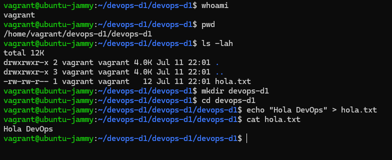
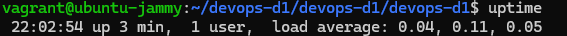
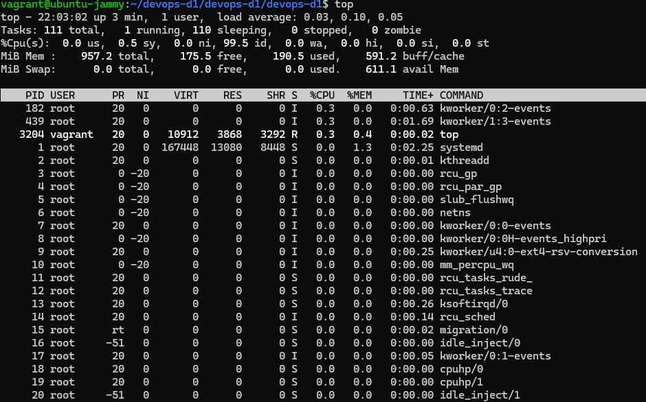

# 💬 Reflexión sobre DevOps

## 👉 ¿Qué significa DevOps para vos después de esta lección?

Después de esta lección, veo DevOps como una **cultura de colaboración y mejora continua** que une desarrollo y operaciones para entregar valor de forma más rápida y confiable.

Más que automatización, promueve **comunicación, integración y entrega continua**, sin perder calidad. Me interesa seguir profundizando porque **adoptar sus principios puede potenciar mi productividad** y mi aporte a cualquier equipo.

---

## 👉 ¿Qué herramientas ya conocías y cuáles son nuevas?

### 🔧 Herramientas que ya conocía:

- **Kubernetes**
- **Terraform**
- **Linux**
- **AWS**
- **Docker**
- **Ansible**
- **Jenkins**

## 2. 🖥️ Primeros Pasos en Linux

En esta sección se muestran los primeros comandos ejecutados en un entorno Linux.

### 📸 Capturas de pantalla

#### 🔹 Commandos Basicos de Linux

## 3. 🎯 Desafío: ¡Linux Detectives!

### 👉 ¿Cuánto tiempo lleva encendido tu sistema?

### 👉 ¿Qué procesos están consumiendo más recursos?

### 👉 ¿Cuánta memoria disponible tenés?

