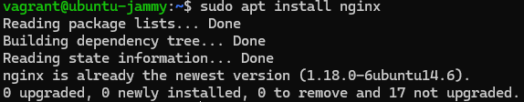
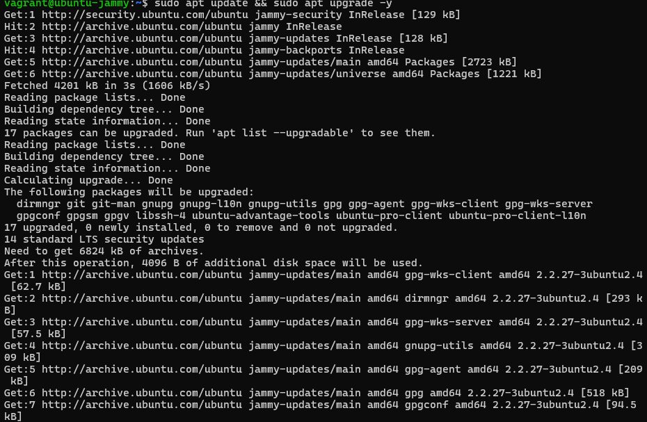
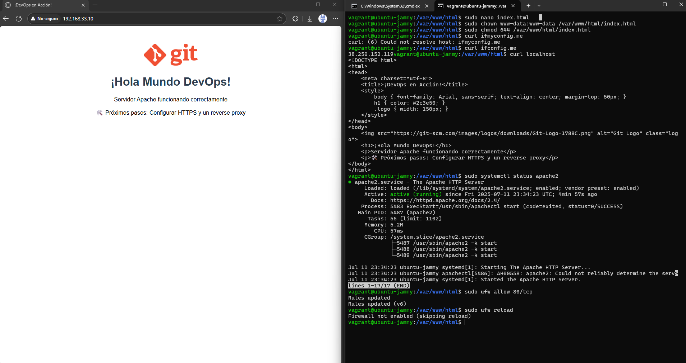
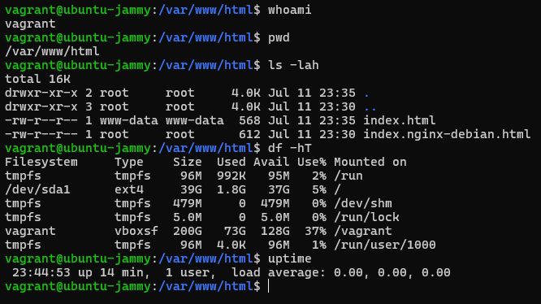
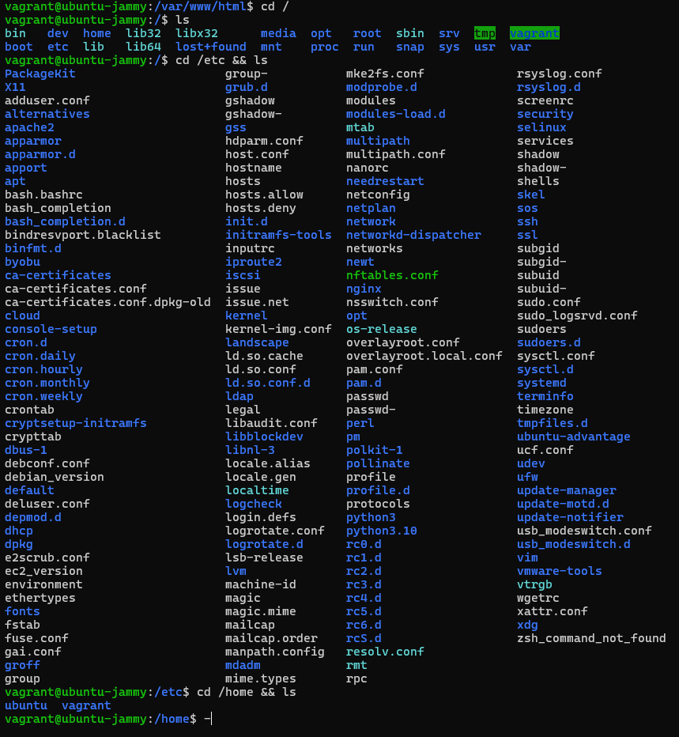
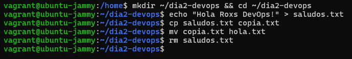
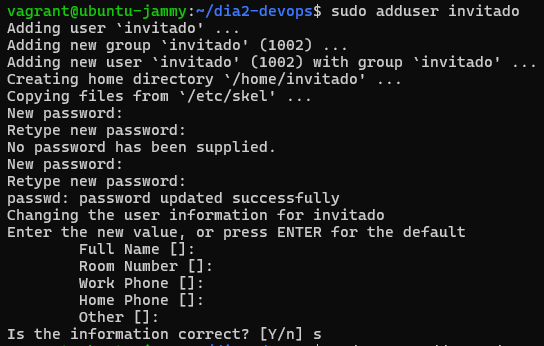
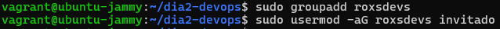
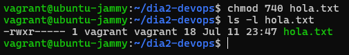
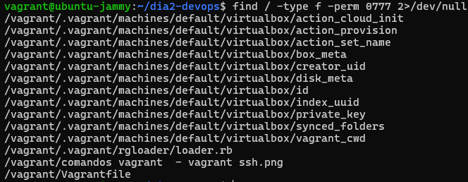

# Actividades Dia 2

## 🚀 Caso Práctico: Instalar y Configurar Nginx

## 🌍 Desplegando un "Hola Mundo" en Apache.

### 🚀 Paso 2: Instalar Apache

### 📂 Paso 3: Crear la Página Web

## 📚 Tarea Opcional del Día 2

### 🛠️ 1. Exploración básica

### 📂 2. Crea y manipulá archivos

### 👥 3. Usuarios y permisos

### 🔐 4. Buscá archivos con permisos peligrosos

### 🧠 5. Reto de comprensión

El comando cambia los permisos según el tipo de usuario ejemplo el propietario tiene rwx por el acceso total, el grupo rx y otros sin acceso.