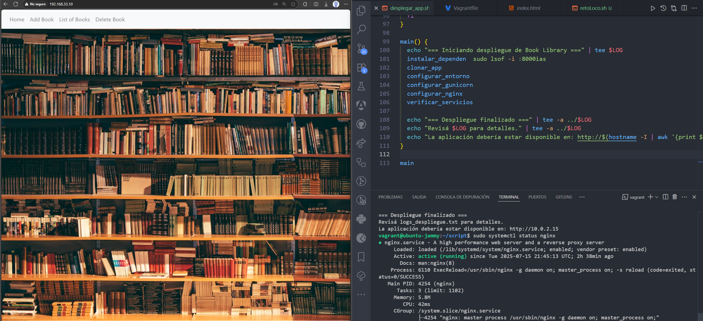

# ⚙️ Automatizando Tareas con Bash Scripting I

---

## 📂 Ejercicios realizados

Los scripts y soluciones se encuentran organizados en la carpeta correspondiente a este día.

---

## 💥 Bonus DevOps

  
<strong>Automatizá el Despliegue de la Aplicación Flask 📚Book Library📚 con Nginx y Gunicorn</strong>

   
  Automatiza el proceso de despliegue usando Bash, Nginx y Gunicorn. ¡Desafío ideal para DevOps!

